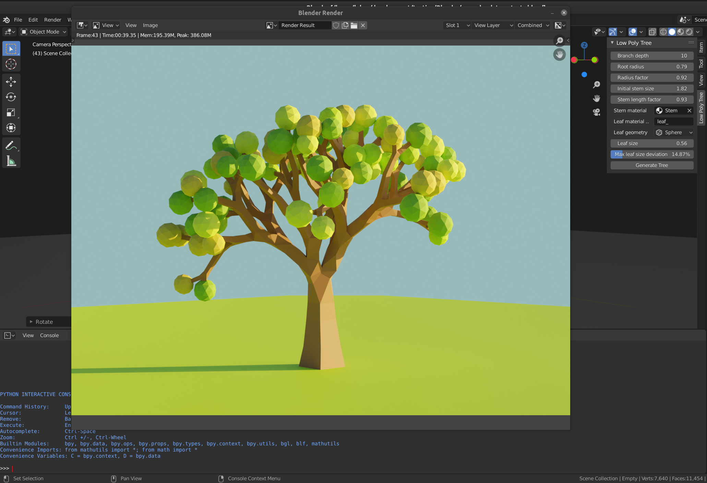

# Blender low poly tree generator

This add-on creates procedural low-poly style trees in Blender 2.8+. It is still in early
development but the results can be quite useful :-)

## Installation

1. Download the latest release: [https://github.com/LuFlo/low-poly-tree-generator/releases](https://github.com/LuFlo/low-poly-tree-generator/releases)
2. Open Blender, go to Edit > Preferences > Add-ons
3. Click the "Install..." button in the top right corner
4. Choose the .zip file you have downloaded beforehand
5. Check the checkbox in order to enable the add-on. Don't forget to save your preferences.

## Quick introduction

After installation you should see a new tab in the properties panel (press "N" if properties
panel is not visible). After setting the desired options and selecting the materials for the
stem and leaves, you can click the "Generate Tree" button in order to create the tree in the
location of the 3D-cursor. Be aware that high numbers for the branch depth option can result
in Blender not being responding for a long time! Values lower that 10 should not resolve in
any problems.

You can alter the stem vertex radii after generating the tree. The Add-on uses the skin
modifier which you have to apply manually.

## Limitations

Currently the leaf geometry is very limited. Only Ico-Spheres and Cubes are supported. Also

## Contribute and help

Feel free to open issues on github! Also I do accept pull-request but since I am developing
this add-on in my free time it can take some time until I review the PR.
